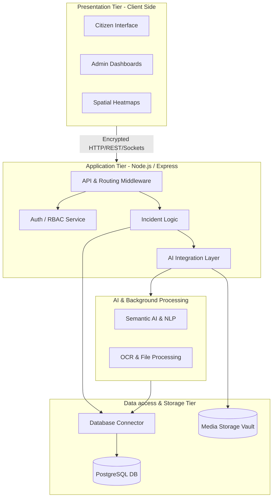
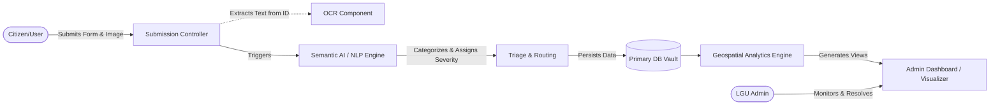
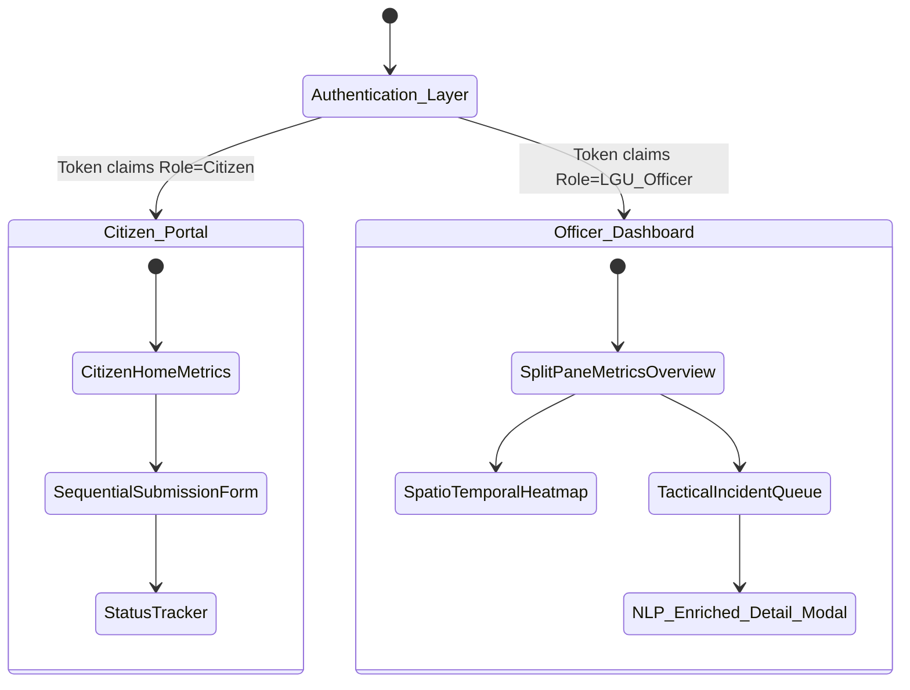

# DRIMS — Detailed Architecture, Components & Physical Design

> **Document Context:** Expanded from `docs/architecture/system_design_academic.md`
> **System:** Digos Reporting & Incident Management System (DRIMS) v2.0

This document consolidates the rigorous technical analysis of the DRIMS architecture, merging the systemic specifications with actionable architectural flowcharts and implementation code snippets across Logical Architecture, Functional Components, and Physical GUI Design.

---

## 1.1. Logical Architecture

The DRIMS platform employs a modular, **N-tier (layered) architectural paradigm**. This structured separation of concerns ensures that modifications within core business logic or data persistence mechanisms operate orthogonally to the client-facing interfaces.

### N-Tier Strata
1. **Presentation Layer**: HTML5/CSS3/JS rendering the DOM, managing client-state continuity, and async HTTP requests.
2. **Routing & Middleware Layer**: The application gateway. Intercepts network requests, enforces IP rate-limiting, validates JWT authentication payloads, and sanitizes requests.
3. **Business Logic Layer**: The core environment where controllers orchestrate calls to AI pipelines (NLP), compute categorizations, and manage incident state lifecycles.
4. **Data Access Layer**: Translates logical operations into optimized SQL queries, decoupling application logic from the underlying schema.
5. **Persistent Storage Layer**: Distributes PostgreSQL instance warehousing relational datasets, credentials, audit logs, and encrypted media binaries.

### N-Tier Data Flow Diagram



### Logical Architecture Code Snippet: App Initialization

```javascript
// src/server/app.js - Application Entry Point Initialization
require("dotenv").config();
const express = require('express');
const schedulerService = require("./services/SchedulerService");
const advancedDecisionEngine = require("./services/ml/AdvancedDecisionEngine");

async function startSystemServer() {
    const app = express();
    
    // Middleware Layer: Security & Payload Sanitization
    app.use(express.json());
    app.use(require('./middleware/securityHeaders'));

    // Routing & Controllers Layer
    app.use('/api/v1/complaints', require('./routes/complaintRoutes'));
    app.use('/api/v1/auth', require('./routes/authRoutes'));

    // Bind network listeners
    const PORT = process.env.PORT || 3000;
    app.listen(PORT, () => {
        console.log(`DRIMS Logical Application Tier bound to port ${PORT}`);
    });

    // Initialize Background Processing Tiers
    schedulerService.start();
    advancedDecisionEngine.initialize();
}

startSystemServer();
```

---

## 1.2. Functional Components

The backend architecture consists of highly specialized integrated modules and logical engines interacting asynchronously to sustain system operations beyond basic CRUD pipelines.

### Key Specialized Subsystems
*   **Authentication & RBAC Engine:** Handles JWT issuance, bcrypt hashing, and strict Role-Based Access Control isolating Citizens from Coordinators and SuperAdmins.
*   **Semantic AI / NLP Engine:** Parses unstructured natural language input. It neutralizes colloquialisms and localized dialect semantics, algorithmically categorizing raw strings into standard municipal taxonomies using textual embeddings.
*   **Geospatial Analytics Engine:** Ingests long/lat coordinates natively, executing volumetric clustering algorithms to project dynamic visual incident density.
*   **Anomaly Detection & Deduping:** Evaluates text-similarity quotients and spatial proximity models to merge redundant reports automatically, optimizing deployment resources.
*   **Optical Character Recognition (OCR):** Computer vision that isolates alphanumeric strings from government identity uploads to prevent account falsification.

### Incident Data Lifecycle & Interaction Diagram



### Functional Component Code Snippet: Semantic AI Integration & Storage

```javascript
// src/server/controllers/complaintController.js
const db = require('../../db/connection');
const aiService = require('../services/semanticAi');
const geoService = require('../services/spatialClustering');

exports.submitIncident = async (req, res) => {
    try {
        const { description, location, mediaBlobs } = req.body;
        
        // Target Component 1: Semantic AI processing pipeline
        const nlpInference = await aiService.analyzeTextForTaxonomy(description);
        
        // Target Component 2: Core storage & transactional persistence
        const result = await db.query(
            'INSERT INTO incidents (description, geom, taxonomy, status) VALUES (?, ST_GeomFromGeoJSON(?), ?, ?)',
            [description, JSON.stringify(location.geojson), JSON.stringify(nlpInference), 'Submitted']
        );

        // Target Component 3: Geospatial visualizer caching update
        await geoService.updateClusterDensities(location.coordinates);

        res.status(201).json({ success: true, aiCategorization: nlpInference });
    } catch (error) {
        res.status(500).json({ error: 'Functional component pipeline failure.' });
    }
};
```

---

## 1.3. Physical Design (Graphical User Interface - GUI)

The Graphical User Interface (GUI) architecture focuses on cognitive load reduction, modal structuring, and responsive structural data projection, heavily segregated by user intent and role.

### Client-Side Visual Modules
1.  **Discretized Citizen Pipeline Form**: Transmutes complex municipal data requirements into sequential flows: Qualitative Strings → Interactive Geospatial Placement Map → Async Drag-and-Drop Blob Uploading. Employs prominent quantitative numerical data cards.
2.  **Spatio-Temporal Visualizer (Heatmaps)**: A standalone map canvas that renders spatial coordinate arrays dynamically. Opacity and gradient rendering natively project severity and frequency densities, coupled with poly-barrier filtering APIs.
3.  **Triage Assessment Interface (Admin / Coordinator)**: High-density tactical tracking. Adopts a split-pane DOM configuration integrating an async mutating incident queue against a full geographic visualizer and quantitative histograms/charting overviews. Dark mode by default for prolonged operative ocular relief.

### GUI Screen Navigation Diagram



### Physical Design GUI Code Snippet: Triage Assessment Dashboard Structure

```html
<!-- views/pages/admin/triageDashboard.html (or EJS) -->
<!DOCTYPE html>
<html lang="en">
<head>
    <meta charset="UTF-8">
    <title>DRIMS | Tactical Triage Center</title>
    <!-- Physical structural CSS components -->
    <link rel="stylesheet" href="/css/base/main.css">
    <link rel="stylesheet" href="/css/components/heatmapRedesign.css">
    <link rel="stylesheet" href="/css/layouts/splitPane.css">
</head>
<body class="theme-dark admin-triage-view">
    
    <!-- Functional Navigation Component -->
    <nav class="sidebar-matrix">
        <div class="branding">DRIMS Command</div>
        <ul class="rbac-links">
            <li><a href="#overview">Command Overview</a></li>
            <li><a href="#queue" class="active">Triage Queue</a></li>
            <li><a href="#gis">GIS Heatmap Matrix</a></li>
        </ul>
    </nav>

    <!-- Physical Layout: Split-Pane Assessment UI -->
    <main class="viewport-split">
        
        <!-- Left Pane: NLP-Enriched Queue -->
        <section class="pane data-queue">
            <header class="queue-header">
                <h3>Asynchronous Priority Queue</h3>
            </header>
            <div id="incident-feed" class="scrollable-feed">
                <!-- Javascript asynchronously injects alert cards here -->
            </div>
        </section>

        <!-- Right Pane: Spatial Visualization Canvas -->
        <section class="pane spatial-canvas">
            <div id="tactical-heatmap-container" class="map-wrapper">
                <!-- Mounted interactive GIS element / WebGL canvas -->
                <canvas id="drims-spatial-cluster-engine"></canvas>
            </div>
            
            <div class="floating-metrics-card">
                <h4>Temporal Incident Density</h4>
                <div id="chart-mount-point"></div>
            </div>
        </section>
        
    </main>

    <!-- Asynchronous DOM controllers -->
    <script src="/js/admin/triageController.js"></script>
    <script src="/js/utils/spatialVisualizer.js"></script>
</body>
</html>
```