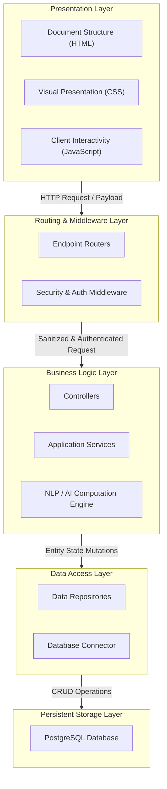
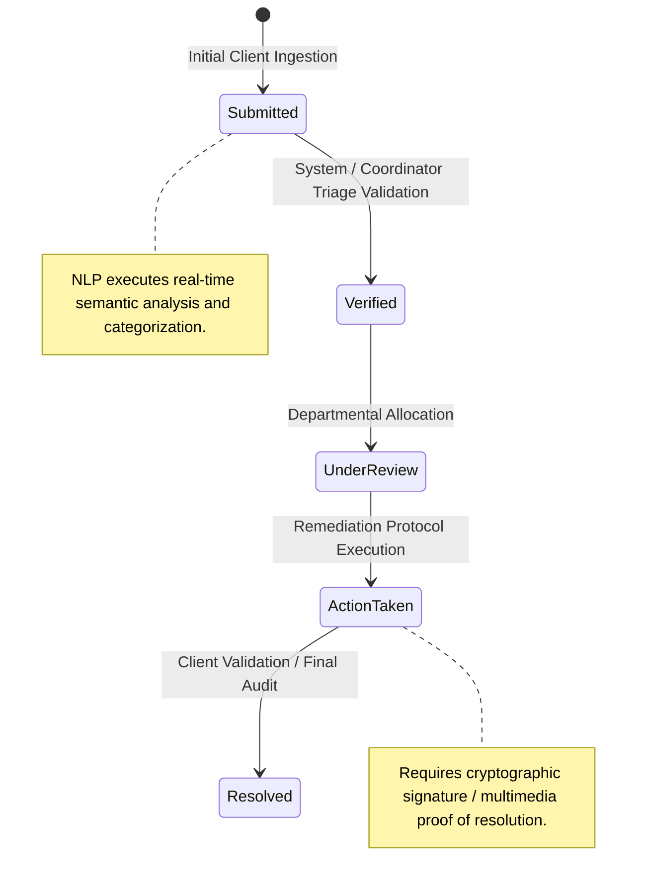

# DRIMS — System Architecture and Design Specification

> **Document Version:** 2.0  
> **Date:** April 9, 2026  
> **System:** Digos Reporting & Incident Management System (DRIMS) v2.0  

This specification delineates the system design and architecture for the Digos Reporting & Incident Management System (DRIMS). The objective of this document is to provide a rigorous, technical analysis of the software architecture, the internal sequential processes, and the interaction design protocols governing the platform. 

The software architecture is categorized into three primary domains:
1. **Logical Architecture:** Structural organization and data flow abstraction.
2. **Functional Components:** Specialized service modules and programmatic subsystems.
3. **Physical Design (GUI):** Client-side interface components and human-computer interaction (HCI) considerations.

---

## 1. Logical Architecture

The DRIMS platform employs a modular, N-tier (layered) architectural paradigm. This structured separation of concerns ensures that modifications within core business logic or data persistence mechanisms operate orthogonally to the client-facing interfaces, ensuring systemic high availability and maintainability.

### 1.1 The N-Tier Architectural Strata

1. **Presentation Layer**: Responsible for rendering the user interface and processing client-side interactions. Implemented utilizing HTML5, CSS3, and JavaScript, it manages Document Object Model (DOM) manipulation, client-state continuity, and asynchronous HTTP client requests.
2. **Routing & Middleware Layer**: Operates as the application gateway. It intercepts incoming network requests, enforcing critical security protocols—including rate-limiting, authentication payload validation, and request sanitization—prior to delegating traffic to subsequent logic controllers.
3. **Business Logic Layer**: Comprises the application controllers and service modules that execute the core operations of the municipal platform. It computes categorizations, manages incident state lifecycles, and orchestrates calls to artificial intelligence computing pipelines.
4. **Data Access Layer**: Acts as an intermediary abstraction layer centralizing database transactions. It translates logical operations from the service layer into optimized relational database querying languages, effectively decoupling the application logic from the underlying storage schema.
5. **Database / External Services Layer**: Provides persistent storage infrastructure. DRIMS utilizes a distributed PostgreSQL instance to securely warehouse relational datasets, cryptographic credentials, system audit logs, and encrypted multimedia binaries.



### 1.2 Request Lifecycle: Incident Submission Sequence

To illustrate the sequential data flow, the execution pipeline for a standard incident report submission is detailed below:

1. **Client Payload Dispatch**: The client application compiles unstructured textual descriptions, geolocation coordinates, and evidentiary media into a structured JSON payload, transmitting it securely via HTTPS.
2. **Middleware Interception**: The API gateway parses the incoming request, wherein middleware validates cryptographic session tokens, enforces IP rate-limit thresholds, and sanitizes payload parameters against injection vulnerabilities.
3. **Controller Delegation**: Upon successful middleware traversal, the endpoint router delegates processing to the `ComplaintController`, which encapsulates the request and invokes the appropriate service layer methods.
4. **Service Execution & Processing**: The `ComplaintCreateService` executes the primary algorithmic workload. It engages the Natural Language Processing (NLP) subsystem to extrapolate semantic context from strings, computes dynamic categorization, executes duplicate-anomaly detection algorithms (evaluating temporal, spatial, and semantic proximity vectors), and generates the database entity model.
5. **Data Persistence execution**: The Data Access Layer executes atomic transactional commits against the PostgreSQL database. Upon successful writing of the data and associated media blobs, a declarative success resolution propagates up the stack, culminating in an HTTP 201 response payload returned to the client.

```javascript
/**
 * Application Entry Point Initialization
 * Orchestrates environment variables, server binding, and background worker instantiation.
 */
require("dotenv").config();

async function startSystemServer() {
  const DRIMSApp = require("./src/server/app");
  const app = new DRIMSApp();
  
  // Bind network listeners to environment-defined ports and host interfaces
  await app.start(config.port, config.host);

  // Initialize asynchronous cron workers for deadline escalations
  const schedulerService = require("./src/server/services/SchedulerService");
  schedulerService.start();

  // Pre-allocate memory and initialize parameters for the Machine Learning models
  const advancedDecisionEngine = require("./src/server/services/ml/AdvancedDecisionEngine");
  advancedDecisionEngine.initialize();
}
```

---

## 2. Functional Components

The backend architecture consists of integrated modules and logical engines that execute asynchronously to sustain the system's operational continuity.

### 2.1 Authentication and Authorization Engine
Manages identity verification protocols, including user registration, cryptographic password hashing via bcrypt, session management, and JSON Web Token (JWT) issuance. It enforces a strict programmatic Role-Based Access Control (RBAC) paradigm, isolating execution privileges among Citizen, Government Officer, Coordinator, and Administrator hierarchies to preclude unauthorized escalation.

### 2.2 Incident Lifecycle Management State Machine
Engineered as an internal state machine delineating the canonical progression of a citizen report. Status mutations follow a strict sequence from *Submitted* and *Verified*, through internal transition states of *Under Review* and *Action Taken*, culminating in *Resolved*. Strict programmatic constraints prevent invalid state transitions.



### 2.3 Natural Language Processing (NLP) Engine
An integrated semantic analysis framework leveraging advanced computational modeling (e.g., TensorFlow text embeddings) to parse unstructured natural language input. It neutralizes colloquialisms and localized dialect semantics, algorithmically categorizing raw strings into normalized municipal taxonomies (e.g., classifying localized infrastructural slang under standard "Public Works" categories) and generating initial severity prioritization metrics.

### 2.4 Anomaly and Duplication Detection Subsystem
Executes a multi-variable algorithmic analysis designed to identify isomorphic reporting clusters. By evaluating text-similarity quotients, conducting geospatial proximity checks utilizing spherical coordinate models, and measuring temporal density, the system algorithmically merges redundant independent reports into unified parent clusters, optimizing resource dispatcher allocation.

### 2.5 Geospatial Analytics Engine
Ingests longitudinal and latitudinal incident coordinates executing a K-dimensional aggregation protocol. It calculates volumetric clustering algorithms to dynamically project localized incident severity onto an interactive client mapping interface, providing temporal intelligence for municipal resource deployment.

### 2.6 Coordinator Triage and Distribution Module
A specialized interface component engineered to optimize human-in-the-loop (HITL) procedures. It consolidates unprocessed inputs into an asynchronous ingress queue, facilitating complex inter-departmental allocation mapping and the establishment of combined task-force entity structures.

### 2.7 Automated Asynchronous Notification Pipeline
An event-driven communication dispatcher. Utilizing both SMTP protocol configurations and WebSocket bindings, it propagates transactional event receipts, task allocation notifications, and SLA deadline transgressions to appropriate user state endpoints in real-time.

### 2.8 Dynamic Taxonomy Management
Implements a declarative relational mapping architecture that permits dynamic administrative mutations to system complaint categories and organizational routing logic without requiring source-code recompilation or database schema mutations.

### 2.9 RBAC and Organizational Matrix Subsystem
Manages human capital state variables for government authorities interacting with the system. It strictly enforces immutable administrative audit logging—serializing all privilege modifications, departmental allocation changes, and user termination requests for compliance and oversight integration.

### 2.10 Multi-Layered Security Framework
An integrated defense mechanism executing parallel heuristic validations on incoming payloads. It includes real-time string sanitization against SQL injection architectures, cross-site scripting (XSS) neutralizations, and employs strict sliding-window request throttling to mitigate distributed denial of service or botnet volumetric exhaustion vectors.

### 2.11 Asynchronous Task Scheduler
Utilizes background chron-job dispatchers designed for periodic database evaluations. The module analyzes pending entity states, automatically enforcing Service Level Agreement (SLA) heuristics by triggering administrative escalations if defined response velocity parameters are breached.

### 2.12 Optical Character Recognition (OCR) Identity Extraction
Incorporates algorithmic computer vision frameworks to analyze uploaded government identity documentation. The engine isolates and extracts distinct alphanumeric strings (e.g., Date of Birth, National ID iterations) to cross-reference client form inputs, algorithmically limiting account falsification.

### 2.13 Encrypted Digital Evidence Vault
Administers the binary large object (BLOB) storage parameters. Executing discrete File I/O algorithms, evidentiary and resolution media files are cryptographically isolated behind layered access controls to prevent unauthenticated topological exposure.

---

## 3. Physical Design (GUI) and Interaction Architecture

The Graphical User Interface (GUI) is engineered utilizing modern human-computer interaction (HCI) methodologies. Design choices prioritize systemic visual clarity, cognitive load reduction, modal structuring, and responsive data projection methodologies. 

### 3.1 Authentication Interface Layer
Implements a minimalist architectural aesthetic emphasizing high-contrast layout structuring, employing glassmorphism components to communicate systemic modernity. Oauth2 protocol flows are seamlessly integrated alongside standard localized credential ingestion forms.

### 3.2 Citizen Dashboard Architecture
Designed heuristically to minimize client operational anxiety and maximize systemic transparency. Employs prominent quantitative numerical data cards outputting atomic system state variables (e.g., active vs. resolved metrics). Navigation structures are enforced by universally normalized iconography.

### 3.3 Discretized Interaction Pipeline (Submission Form)
Transmutes complex data-entry requirements into a multi-stage sequential user flow:
1. **Qualitative Metrics:** Component parsing unstructured text string implementations.
2. **Geospatial Mapping:** Interactive map components leveraging geographic coordinate selector APIs.
3. **Asynchronous Ingestion:** Visual drag-and-drop elements for asynchronous multi-part media uploads.

### 3.4 Administrative Analytics Environment
Provides high-density administrative tracking visualization properties. Data points are aggregated mathematically and visually translated using contemporary charting frameworks (e.g., pie distributions, bar histograms, temporal line trends). System defaults implement dark-mode topological styles to diminish prolonged screen ocular fatigue metrics.

### 3.5 Spatio-Temporal Visualizer (Geomapping)
Renders full DOM real-time coordinate arrays. Distinct geographic opacities and gradient rendering quantitatively indicate incident density. This visualization integrates advanced localized filtering vectors based precisely on localized multi-polygonal barriers and temporal queries.

### 3.6 Triage Assessment Interface
Engineered to maximize evaluation throughput. Adopts a split-pane DOM configuration integrating a consistently mutating asynchronous ticket queue juxtaposed against an expanded qualitative read-view. UI elements explicitly manifest the underlying NLP predictive intelligence factors, accelerating authorized human judgment processes.
