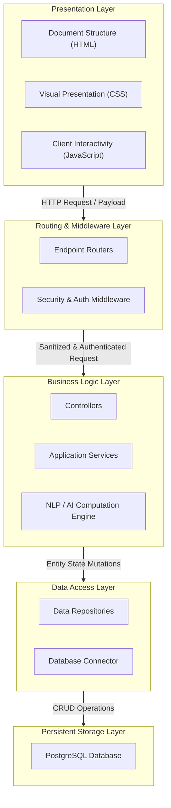
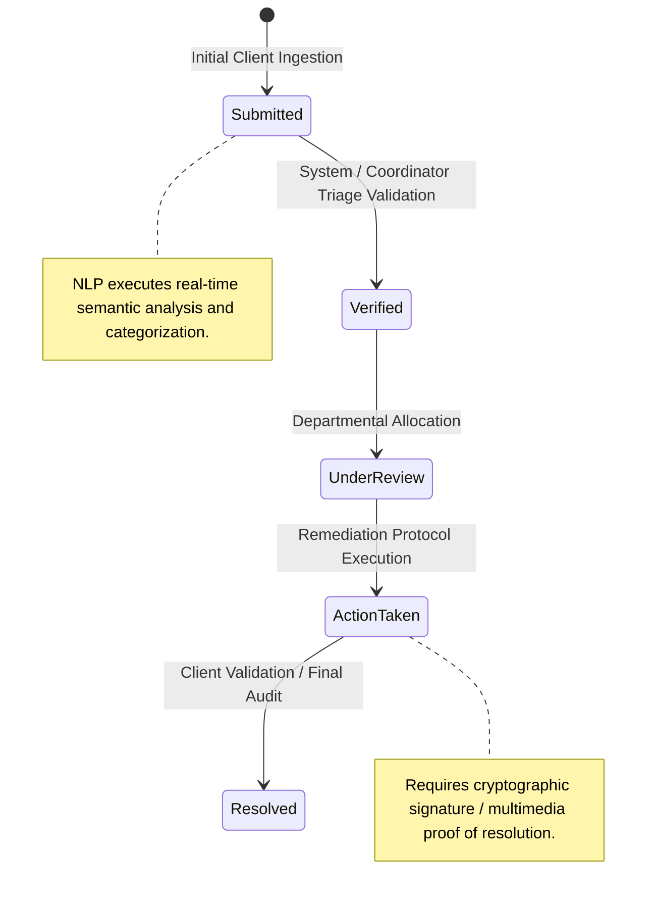

# DRIMS — System Architecture and Design Specification

> **Document Version:** 2.0  
> **Date:** April 9, 2026  
> **System:** Digos Reporting & Incident Management System (DRIMS) v2.0  

This specification delineates the system design and architecture for the Digos Reporting & Incident Management System (DRIMS). The objective of this document is to provide a rigorous, technical analysis of the software architecture, the internal sequential processes, and the interaction design protocols governing the platform. 

The software architecture is categorized into three primary domains:
1. **Logical Architecture:** Structural organization and data flow abstraction.
2. **Functional Components:** Specialized service modules and programmatic subsystems.
3. **Physical Design (GUI):** Client-side interface components and human-computer interaction (HCI) considerations.

---

## 1. Logical Architecture

The DRIMS platform employs a modular, N-tier (layered) architectural paradigm. This structured separation of concerns ensures that modifications within core business logic or data persistence mechanisms operate orthogonally to the client-facing interfaces, ensuring systemic high availability and maintainability.

### 1.1 The N-Tier Architectural Strata

1. **Presentation Layer (Client-Side Rendering):** Operates entirely within the user's browser or mobile webview. It is purely stateless, handling DOM representations constructed via dynamic HTML5 and CSS3 mapping. The JavaScript component manages localized state continuity (e.g., buffering partial form inputs), intercepts UI events, and constructs strictly typed JSON payloads for asynchronous Transmission Control Protocol (TCP) handshakes via HTTPS, abstracting local device APIs (such as the Geolocation API or Camera media streams) from the backend.
2. **Routing & Middleware Layer (The Gateway):** The primary ingress point acting as a reverse-proxy and defensive perimeter. It intercepts all incoming RESTful and WebSocket traffic. Here, deterministic middleware pipelines execute critical security heuristics: validating cryptographic signatures of JSON Web Tokens (JWT) mapped to the `Authorization: Bearer` header, enforcing strict memory-backed IP rate-limiting using algorithms like Token Bucket, and actively stripping malicious string executions (Cross-Site Scripting or SQL injection signatures) before the payload penetrates the internal application space.
3. **Business Logic Layer (Application Controllers):** The cerebral core of the DRIMS platform. This layer calculates all proprietary operational algorithms. It remains fully decoupled from network concerns, ingesting sanitized data structures to manipulate internal business states. The controllers directly instantiate domain-specific models, trigger calls to localized background AI microservices, enforce temporal Service Level Agreements (SLAs), and handle complex algorithmic transactions, such as deduplicating incoming municipal complaints based on multidimensional analysis.
4. **Data Access Layer (Persistence Abstraction):** Functions as an Object-Relational Mapping (ORM) and low-level driver interface (e.g., `pg` or `knex`). This layer shields the Business Logic Layer from SQL dialect nuances, constructing parameterized, prepared statements to guarantee atomicity, consistency, isolation, and durability (ACID) compliance during database writes. It includes built-in concurrency controls for simultaneous incident report submissions, eliminating race conditions.
5. **Database / External Services Layer (Storage Infrastructure):** The physical or distributed storage bedrock. Primary storage is handled by a partitioned PostgreSQL relational database customized with the PostGIS extension to allow raw geographic spatial querying natively on the server. Supplementary infrastructure accommodates caching layers (e.g., Redis for caching clustered heatmap coordinates to reduce DB thermal limits) and cryptographically sealed, immutable external Blob storage volumes holding evidentiary multimedia.



### 1.2 Request Lifecycle: Incident Submission Sequence

To mathematically illustrate the sequential logical data flow of the architecture, the exact execution pipeline for a standard incident report submission is detailed step-by-step:

1. **Client Payload Dispatch State**: The presentation tier assembles asynchronous client inputs. Standard strings, precise floating-point geospatial coordinates (`lat, lng`), and large multimedia files (binary encoded) are merged. The JS client standardizes this object via the `FormData` or JSON interface, applying a unique idempotency key string, and dispatches the structure onto the network via a secure HTTPS asynchronous transmission (`fetch`).
2. **Middleware Interception Protocol**: At the Node.js Express perimeter, incoming packet streams are caught. The `RateLimiter` evaluates the request's originating IP against a time-decaying cache window to block Denial-of-Service attacks. The `AuthMiddleware` verifies valid `Authorization` tokens, decoding the JWT to extract the unique user `uuid` and permissions map. Final sanitization middlewares traverse the object keys to escape any unencoded string characters preventing injection vulnerabilities.
3. **Controller Delegation (The Hand-off)**: Reaching the application context safely, the request `req.body` is handed explicitly to the `IncidentController`. This module acts strictly as the conductor, orchestrating lower-level Service invocations. It unwraps the payload, initiates an asynchronous block, and maps out the necessary sequential AI and storage dependencies to handle the entity.
4. **Service Execution & Algorithmic Computations**: The `ComplaintCreateService` starts the primary workload logic. 
    *   *Step A (Inference)*: Calls the Natural Language Processing (semantic-AI) dependency to build predictive text embeddings off the user's description, returning a normalized `municipality-taxonomy` string.
    *   *Step B (Heuristics)*: Invokes spatial distance calculations. Utilizing the spherical coordinates (e.g., Haversine formula), it cross-references recent database entries to identify if this represents an anomaly or a duplicate event.
    *   *Step C (Generation)*: Generates the internal structural map of the new (or linked) entity, incorporating current UTC timestamps and the "Submitted" state string.
5. **Atomic Data Persistence Execution**: Finally, the system initiates the Data Access Layer ORM. A prepared SQL transaction command executes a blocking `INSERT` operation against the remote PostgreSQL cluster, appending the record alongside its geometric indices (`ST_GeomFromGeoJSON`). If the commit concludes without a rollback flag, a cascading callback modifies related real-time memory caches, after which the process culminates by tearing down the request stream securely and forwarding a declarative HTTP 201 Created acknowledgment back through the protocol stack to client application state.

### 1.3 Application Initialization & Layer Integration (Code Reference)

The following implementation details the binding of the N-tier architecture strata (Middleware, Routing, and Background Engines) at the application's entry point:

```javascript
/**
 * Application Entry Point Initialization
 * Orchestrates environment variables, server binding, middleware strata, and background worker instantiation.
 */
require("dotenv").config();
const express = require('express');

async function startSystemServer() {
  const app = express();
  
  // 1. Routing & Middleware Layer: Security & Payload Sanitization
  app.use(express.json());
  app.use(require('./src/server/middleware/securityHeaders'));
  app.use(require('./src/server/middleware/rateLimiter'));

  // 2. Business Logic Layer Delegation (Controllers orchestrate AI & DB calls)
  app.use('/api/v1/complaints', require('./src/server/routes/complaintRoutes'));
  app.use('/api/v1/auth', require('./src/server/routes/authRoutes'));

  // 3. Bind network listeners to environment-defined ports and host interfaces
  const PORT = process.env.PORT || 3000;
  app.listen(PORT, () => {
      console.log(`DRIMS Logical Application Tier bound to port ${PORT}`);
  });

  // 4. Initialize Background Processing Tiers & Persistent Workers
  const schedulerService = require("./src/server/services/SchedulerService");
  schedulerService.start();

  const advancedDecisionEngine = require("./src/server/services/ml/AdvancedDecisionEngine");
  advancedDecisionEngine.initialize();
}

startSystemServer();
```

---

## 2. Functional Components

The backend architecture consists of integrated modules and logical engines that execute asynchronously to sustain the system's operational continuity.

### 2.1 Core Subsystem Integration & Controller Orchestration
The primary functional pipeline of the DRIMS architecture relies on the controller layer acting as a central orchestrator connecting otherwise isolated processing modules. Rather than monolithic execution, the functional logic follows a deterministic pipeline bridging AI, Storage, and Cache updating:
- **Phase 1 (Inference Engine):** It suspends `await`ing the **Semantic AI (NLP)** service to analyze the raw, unstructured civic complaint, waiting for it to return a structured taxonomy object (categorization tags and severity matrices).
- **Phase 2 (Persistence Engine):** It synchronizes with the **Data Persistence Module**, committing the structured NLP data and the encoded Geographic JSON parameters down into the persistent PostGIS database vault utilizing parameterized arrays to prevent SQL-injection vectors.
- **Phase 3 (Asynchronous Event Propagation):** Finally, it executes a non-blocking "fire-and-forget" broadcast (`geoClustering.recalculateDensities()`). This updates the **Geospatial Map Cache** in the background without forcing the Citizen client to wait for complex volumetric calculating algorithms to finish. By divorcing the heavy map-rendering logic from the response lifecycle, it maximizes HTTP application responsiveness and minimizes perceived UI latency.

The exact mechanical execution of these three integrated functional components is referenced in the controller schema below:

```javascript
// src/server/controllers/complaintController.js
const db = require('../../db/connection');
const semanticAi = require('../services/semanticAi');
const geoClustering = require('../services/spatialClustering');

exports.submitIncident = async (req, res) => {
    try {
        const { description, location } = req.body;
        
        // Target Module 1: NLP / Semantic AI Inference Pipeline
        const inferredTags = await semanticAi.analyzeTaxonomyOutput(description);
        
        // Target Module 2: Data Persistence & Encrypted BLOB mappings
        const incidentId = await db.query(
            'INSERT INTO incidents (description, geometry, context_tags) VALUES (?, ST_GeomFromGeoJSON(?), ?)',
            [description, JSON.stringify(location), JSON.stringify(inferredTags)]
        );

        // Target Module 3: Geospatial Visualizer Clustering Map Update (Asynchronous)
        geoClustering.recalculateDensities(location.coordinates).catch(err => console.error(err));

        res.status(201).json({ success: true, ai_nlp_tags: inferredTags });
    } catch (e) {
        res.status(500).json({ error: 'Functional component pipeline failure.' });
    }
};
```

### 2.2 Identity Access Management, RBAC, and Security Perimeter
*This segment merges the standalone Authentication logic, Organizational RBAC Matrix, and Multi-Layered Defenses into a singular integrated security component.*

Built upon Oauth2 standards and localized state logic, this functional subsystem forms the baseline of the application security perimeter. The execution strictly follows a defensive-in-depth model:
- **Authentication & Cryptography:** During local credential registration, passwords undergo one-way cryptographic destruction utilizing `bcrypt` hashing algorithms. Mathematical dynamic salts are injected during the hash loop to prevent hardware-accelerated lookup vulnerabilities such as Rainbow Table decryption. Successful authentication yields signed JSON Web Tokens (JWTs), which are securely bound to encrypted, `HTTP-Only`, `SameSite=Strict` client cookies, mechanically preventing Cross-Site Scripting (XSS) payload token extraction.
- **Organizational RBAC Matrix:** The Identity Access Management logic implements deep Role-Based Access Control (RBAC). It evaluates internal memory matrices, mapping Express endpoint route strings recursively to unique identifier types. For example, a middleware hook mathematically analyzes the `req.user.role` extracted from the JWT. If a `Citizen` role schema attempts to `POST` a JSON body to an endpoint requiring `Coordinator` clearance, the matrix instantly returns an HTTP 403 Forbidden halt. All privilege modifications inside the matrix are forcefully appended to an immutable administrative PostgreSQL audit table.
- **Multi-Layered Security Framework:** Operating at the outermost Node.js ingress perimeter, this logic bounds incoming payload streams. It runs parallel heuristics (Regex string sanitization against raw SQL structures and memory-backed IP-rate-limiting via Token Bucket algorithms) designed explicitly to automatically throttle or abandon DDoS requests and bot-net traffic *before* the workload touches the heavy API controllers.

### 2.3 Incident Lifecycle State Machine & Coordinator Validation
*This segment integrates the Incident Lifecycle DFA (State Machine), the Coordinator Triage Distribution module, and Automated Notification pipelines.*

Rather than relying on disjointed `status="pending"` string updates within a database controller, DRIMS operates a formally defined Deterministic Finite Automaton (DFA). This structurally engineers the entity statuses, permanently negating erratic progression skipping. 
- **The DFA Vectors:** Status mutations exist exclusively in explicit vector progressions: `[Submitted] → [Verified] → [Under Review] → [Action Taken] → [Resolved]`. Each explicit vector acts as a hardened validation chokepoint executing distinct operational hook requirements. 
- **Coordinator Triage Module (HITL):** This DFA perfectly intertwines with Human-In-The-Loop (HITL) procedures. As the explicit State Machine allows a ticket to safely mutate into "Verified," the Triage routing hook automatically ejects the processed report array into an asynchronous memory queue (ingress pipeline). This maps directly to the Coordinator's dashboard logic allowing for inter-departmental allocation mapping.
- **Automated Asynchronous Notifications:** Every single time the DFA State Machine mutates forward (for instance moving a ticket into `Action Taken` pending municipal completion), an integrated event-emitter triggers. This pipeline translates the transactional receipt into a WebSocket payload, pushing task allocation pings and real-time DOM DOM refreshes directly to the LGU officer screens simultaneously, effectively removing the dependency on client-side HTTP polling loops.



### 2.4 AI-Driven NLP, Taxonomy, and Anomaly Detection Engine
*This segment consolidates the Semantic LLM bridging, Anomaly/Duplicate logic, OCR extraction, and the Dynamic Taxonomy mapping since they execute as a sequential intelligence pipeline.*

Operating as the cognitive inference logic gate, this pipeline triggers deterministically precisely when unstructured civic strings or image array buffers are intercepted from the HTTP hand-shake:
- **Pre-Computation Phase (OCR Extraction):** The first hook parses the internal `FormData` boundary. The **Optical Character Recognition (OCR)** framework instantly extracts raw image binaries. It slices these pixel matrices running computer vision algorithms specifically configured to heuristically isolate text segments (Date-of-Birth, National Identification integers) algorithmically comparing and rejecting false or synthetic accounts.
- **Inference Processing (Semantic NLP Model):** Secondarily, unstructured descriptions undergo advanced **Semantic NLP Model** routines. Utilizing external LLM APIs (e.g. OpenAI) or localized TensorFlow.js memory weights, the descriptions shift into semantic tensor tokenizations. The system calculates absolute distances neutralizing misspellings or regional slang dialects, deterministically pairing the complaint's underlying logic up directly against predefined **Taxonomy** arrays established manually by Government Administrators (i.e. changing `puddle deep hole road` identically to `Hazardous Public Infrastructure (Traffic Severity Level)`.)
- **Post-Computation Phase (Anomaly / Suppression):** Finally, a specialized **Anomaly, Fraud, and Duplication Subsystem** prevents workload overlap calculation. It derives an integer priority score combining a weighted combinatorial equation of three variables: **Spatial Limits** (cross-querying `PostGIS` locations calculating literal meters between two pending nodes), **Temporal Deltas** (subtracting UTC timestamps to check if nodes happened simultaneously), and **Cosine Similarity Math** (the quantitative NLP embedding closeness). Scores overriding a `0.85%` threshold trigger instantaneous suppression flags, stopping duplicate processing completely.

### 2.5 K-Dimensional Geospatial Analytics Engine
The mapping module acts natively within the relational structures. Rather than sending out basic text strings describing location, DRIMS relies heavily on the `GIST` indexing capabilities of the PostgreSQL PostGIS database spatial extension mapping (`ST_GeomFromText()`, `ST_Distance()`).
- **Memory-Based Indexing:** When a citizen records latitude and longitude parameters (such as `10.2974° N, 125.1015° E`), these coordinates are geometrically indexed into a Point or Polygon matrix directly onto a physical DB storage row.
- **Volumetric Spatial Aggregation:** Rather than requesting an array of ten thousand points, placing enormous bandwidth pressure entirely onto the Client UI DOM payload limit, an internal analytics aggregation algorithm (`DBSCAN` or equivalent clustering computations) computes overlapping scalar volumes algorithmically. It maps data bounds via density variables internally grouping localized `epsilon` clusters rendering complex `.geojson` mapping matrices locally in server CPU, and returning a pre-calculated map tile overlay cache explicitly intended to inject seamlessly into a `WebGL` map renderer element. 

### 2.6 Asynchronous Task Scheduler & External Integrity Vault
The final support mechanisms operate structurally completely disjointed from the core CRUD HTTP pipelines. 
- **Asynchronous Loop (The Scheduler):** Generating an isolated asynchronous loop memory worker (`cron-job` logic), it actively queries PostgreSQL metadata independent of HTTP triggers. It executes sequential loop evaluations iterating across all pending administrative incident queues specifically parsing UTC timestamps against pre-configured SLAs (Service Level Agreements). A ticket breaking 72 hours age-limits instantly forces a DB write triggering an escalated `Severity Flag` sent directly via the WebSocket emitter into the LGU matrix.
- **Media Preservation (Evidence Vault):** Administering all localized BLOB payloads (`.jpg`, `.mp4`), an **Encrypted Digital Evidence Vault** isolates citizen submissions on external SSD topological partitions, writing rigid byte-streaming via explicit File I/O algorithms. These arrays encode and completely drop direct client-accessibility flags—there exist absolutely no literal browser URL routing links into the drive partition. Authorized users retrieve binary buffers mechanically routed entirely through Signed-URL cryptographical request arrays dynamically generated explicitly at render time.

---

## 3. Physical Design (GUI) and Interaction Architecture

The Graphical User Interface (GUI) is explicitly engineered utilizing modern Human-Computer Interaction (HCI) methodologies. The entire front-end follows a Mobile-First responsive CSS framework enforcing structural constraints designed strictly for optimal rendering across fragmented ViewPort sizes (such as standardized Android iOS browsers vs 4K command-center monitors). Cognitive load reduction functions as the prime variable shaping modal structures, grid geometries, and color semantics mapping closely to psychological standards (e.g. Red strictly representing critical incidents context mapping).

### 3.1 Authentication Interface Layer
The digital ingress point for all users. Adhering to the psychological principles of Hick's Law, the login UI presents minimalist architectural geometry emphasizing a high-contrast layout matrix and deep CSS glassmorphism overlay patterns to convey systemic reliability. Oauth2 SSO (Single Sign-On, e.g., Google or Microsoft credentials) integrations exist natively as decoupled CSS Flexbox components. They sit parallel alongside the standard Local HTML5 input validations (which utilize RegEx schema evaluation) designed specifically to check localized credentials natively within client memory before TCP dispatch. Wait-state spinners and explicit toast notifications map error states dynamically bridging UX mapping latency intervals.

> **[UI Placeholder: Authentication Form & OAuth Login View]**
> *Path: `/public/assets/images/mockups/auth_interface.png`*
> 

### 3.2 Citizen Dashboard Architecture
Once authorized, instances mapping to Citizen JWT payloads invoke the dashboard skeleton (`citizen_layout.ejs`). Engineered heuristically, this interface structure mitigates general operating anxiety and constructs systemic transparency. At the top of the Document Object flow, the DOM allocates dynamic HTML numerical data cards. These elements bind directly to API responses rendering atomic system state aggregates like quantitative count distributions (`Resolved VS Active`). Navigation elements utilize universally normalized scalable vector graphic (SVG) iconography bounded in a strict fixed bottom `tab-bar` grid implementation for mobile devices and a fixed left-drawer component for wider breakpoint arrays.

> **[UI Placeholder: Citizen Main Dashboard & Nav]**
> *Path: `/public/assets/images/mockups/citizen_dashboard.png`*
> 

### 3.3 Discretized Interaction Pipeline (Submission Form)
A major architectural feature in the UI relies strictly heavily upon the theory of discretizing large complex data entries. The application explicitly transmutes municipal forms into a chunked Multi-Stage Sequential Wizard execution. A single HTML `<form>` tag is visually partitioned relying on Javascript-controlled `display: none` toggle maps:
1. **Qualitative Metrics (Screen 1):** The user evaluates natural-language standard fields (Text string lengths over `<textarea>`).
2. **Geospatial Implementation (Screen 2):** Leverages a mapping framework (like Leaflet or Mapbox). Utilizing the device `Navigator.geolocation` Javascript namespace, a localized map instantiates, locking an interactive draggable pin on the user's localized physical layout automatically.
3. **Asynchronous Contextual Storage (Screen 3):** Exposes drop-zone UI geometries. Executing HTML5 file handling namespaces (`File API`, `<input type="file" capture="environment">`) to ingest camera media directly into client blob structures pre-transmission.

> **[UI Placeholder: Sequential Incident Reporting Form Flow]**
> *Path: `/public/assets/images/mockups/submission_form.png`*
> 

### 3.4 Administrative Analytics Environment
This structural framework explicitly flips the design paradigm from Citizen minimalist aesthetics into high-density temporal visualizations. The DOM layout (`admin Dashboard.ejs`) injects mathematically mapped data variables translating API responses via charting libraries (`D3.js` or `Chart.js`). Key interfaces incorporate Pie Distributions evaluating Incident Taxonomy mapping, Bar-Histogram charting indicating historical LGU throughput, and smooth-spline timeline graphing indicating volume influx rates. Furthermore, entire UI blocks inject dynamic inline styles executing "Dark-Mode" topography standards as the CSS default standard to mitigate visual noise and prolong ocular performance for persistent tracking officers.

> **[UI Placeholder: Government Officer Analytics Data & Charts View]**
> *Path: `/public/assets/images/mockups/admin_analytics.png`*
> 

### 3.5 Spatio-Temporal Visualizer (The WebGL Heatmap)
Executed primarily on a discrete architectural domain component (`standalone-map-viewer`). Rather than HTML DOM mapping constraints, this layer utilizes the native `Canvas` API powered heavily by WebGL to accelerate thousands of dynamic spatial float indices. It relies upon an algorithmic shader that draws floating polygon overlays on localized map bounds. The intensity gradient explicitly utilizes Red-Green-Blue hexadecimal interpolations mapping density volumes visually—a bright red `#ff0000` focal point explicitly quantifies 20+ active reports mapped inside a `.0005` geographical boundary threshold. Custom UI filter bars exist floating above the Canvas manipulating variables dynamically triggering the spatial rendering array asynchronous rebuild functions to instantly modify local query intervals (e.g. tracking “Last 24 Hours” mapping to "Last Month").

> **[UI Placeholder: Full-Screen Spatial Heatmap & Density Map]**
> *Path: `/public/assets/images/mockups/spatial_heatmap.png`*
> 

### 3.6 Triage Assessment Interface (Coordinator Module)
Engineered for maximizing raw cognitive throughput by eliminating unnecessary routing jumps. The system implements a robust `CSS Display: Grid` configuration creating a fluid Split-Pane arrangement. 
On the Left (Side A), a consistently mutating, vertically scrolling un-resolved ticket queue `(<ul>)` is mapped; tickets append vertically triggering animation flashes upon successful WebSocket connections pushing real-time states to DOM indices.
On the Right (Side B), the expanded ticket object manifests contextually without requiring full-page URL navigations. It explicitly renders the algorithmic logic of the background Semantic AI logic visually (e.g., `<span class="badge ai-confidence">98% Match - Public Safety Risk</span>`) empowering quick authorized Administrative clicks mapped into "Approve", "Assign-to-Unit", or "Resolve" controller vectors.

> **[UI Placeholder: Split-pane Coordinator Triage View (Queue + details)]**
> *Path: `/public/assets/images/mockups/triage_assessment.png`*
> 
