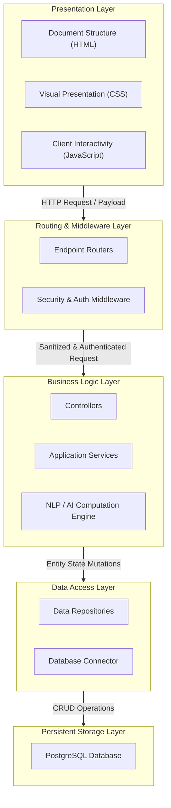
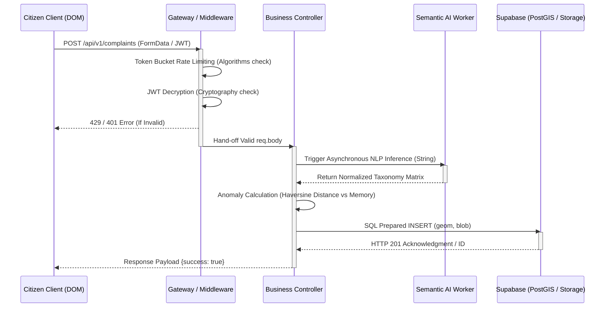
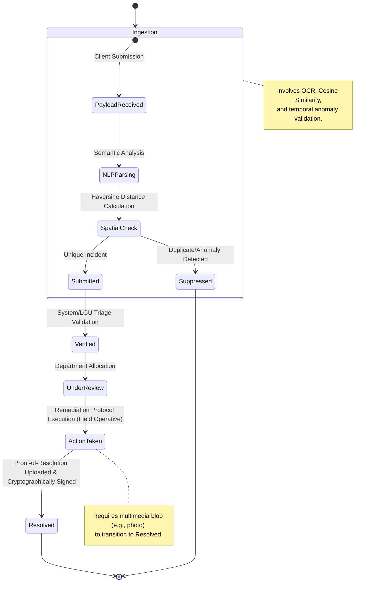
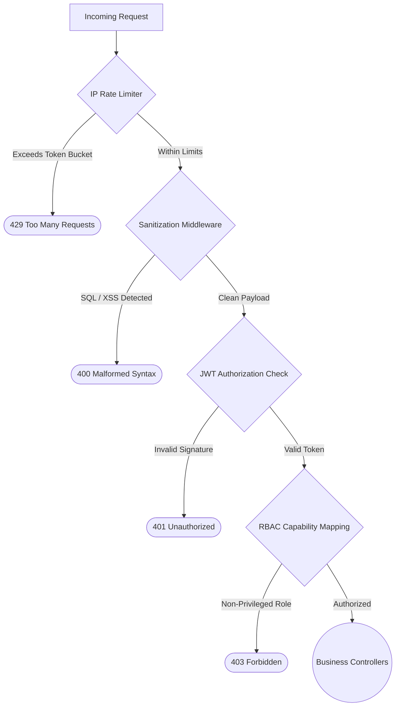
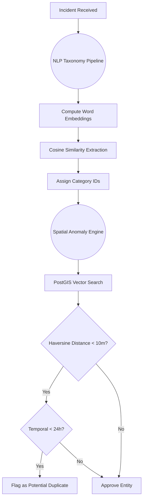

# Extracted Mermaid Diagrams and Code Snippets

## Mermaid Diagrams

### 1. N-Tier Architectural Strata


### 2. Request Lifecycle: Incident Submission Sequence


### 3. State Diagram: Triage Resolution Matrix


### 4. Conceptual Flowchart: Authenticaton & Security Pipeline


### 5. Conceptual Flowchart: Background Spatial & AI Computation


## Code Snippets

### 1. Application Initialization Layer (Bootstrapping Algorithm)
```javascript
// server.js (Core Application Bootstrapping)
require("dotenv").config();
require("./src/server/utils/consoleLogger");
console.log("🚀 Starting DRIMS Server...");

// Set runtime environment parameters
if (!process.env.NODE_ENV) {
  process.env.NODE_ENV = "development";
}

const config = require("./config/app");
try {
  config.validate(); // Algorithmic validation of system dependencies
  console.log("✅ Configuration validated successfully");
  console.log("📊 Config details:", {
    env: config.env,
    port: config.port,
    supabaseConfigured: Boolean(config.supabase.url && config.supabase.anonKey)
  });
} catch (error) {
  console.error("❌ Configuration error:", error.message);
  process.exit(1); // Halt execution if requirements fail
}

const app = require("./app");
app.listen(config.port, () => {
    console.log(`DRIMS Server bound to port ${config.port}`);
});
```

### 2. Core Orchestration Algorithms
```javascript
// src/server/controllers/ComplaintController.js
const ComplaintService = require("../services/ComplaintService");

class ComplaintController {
  constructor() {
    this.complaintService = new ComplaintService();
  }

  async createcomplaint(req, res) {
    const { user } = req;
    const complaintData = req.body;
    const token = req.headers.authorization; // Get cryptographic token

    // Buffer multimedia attachments from the multipart boundary
    let files = [];
    if (req.files && req.files.evidenceFiles) {
      files = req.files.evidenceFiles;
    }

    // Await core business logic extraction
    const complaint = await this.complaintService.createcomplaint(
      user.id,
      complaintData,
      files,
      token
    );

    // Propagate memory state to downstream logic hooks
    res.locals.complaint = complaint;
    res.status(201).json({ success: true, data: complaint });
  }
}
```

### 3. Key Feature: IAM, RBAC, and Security Defense Algorithms
```javascript
// src/server/middleware/auth.js
const { validateUserRole } = require("../utils/roleValidation");

const authenticateUser = async (req, res, next) => {
  try {
    // Priority: Bearer token from headers over cookie persistence
    const authHeader = req.headers.authorization;
    const cookieToken = req.cookies?.sb_access_token;
    const token = authHeader?.replace("Bearer ", "") || cookieToken;

    if (!token) {
      // 401: Initial perimeter drop
      return res.status(401).json({ success: false, error: "Cryptographic Signature Missing" });
    }

    // Role-based boundary evaluation against JWT
    const { data: user, error: authError } = await supabase.auth.getUser(token);
    if (authError || !user) throw new Error("JWT decode failure");
    
    req.user = buildUserObject(user.user);
    next(); // Pass control flag onwards

  } catch (error) {
    return handleAuthError(error, req, res);
  }
};
```

### 4. Key Feature: State Machine Validation & Distribution Workflow
```javascript
// src/server/utils/complaintUtils.js
// Algorithm: Deterministic Progression Vector Mapping
function getWorkflowFromStatus(status) {
    if (!status) return null;
    const statusLower = status.toLowerCase();

    // Map legacy keys to strict structural state strings
    const workflowMap = {
      "submitted": "submitted",
      "pending": "submitted",
      "new": "submitted", 
      "verified": "verified",
      "under review": "under_review",
      "under_review": "under_review",
      "action taken": "action_taken",
      "action_taken": "action_taken",
      "resolved": "resolved",
      "completed": "resolved"
    };

    return workflowMap[statusLower] || null; // Returns null if traversal invalid
}
```

### 5. AI-Driven NLP, Taxonomy, and Anomaly Detection Algorithms
```javascript
// src/server/services/nlp/NLPService.js
// Hybrid Rule-Based + AI Text Analysis Model
class NLPService {
  constructor() {
    this.CATEGORY_REGISTRY = this._initCategoryRegistry();
    this.tensorFlowService = require("../ml/TensorFlowService"); // Fallback Provider
  }

  _initCategoryRegistry() {
    // Mathematical weights assigned to semantic keywords
    return {
      Utilities: {
        keywords: ["walang tubig", "low pressure", "kuryente", "brownout"],
        urgency: 55, confidence: 0.90
      },
      Sanitation: {
        keywords: ["mabaho", "basura", "kalat", "garbage", "dumping"],
        urgency: 42, confidence: 0.88
      }
    };
  }

  // Calculate categorical intersection using frequency tensors
  analyzeStringTopology(inputString) {
     /* Tokenization logic... */
  }
}
```

### 6. K-Dimensional Geospatial Analytics Algorithms
```sql
-- Database Spatial Indexing 
-- Executes on raw tables generating boundary metadata
CREATE INDEX idx_incidents_lat_lng ON public.incidents (latitude, longitude);

-- Mapping queries restrict vector traversal
SELECT 
    id, status, description, type, subtype
FROM 
    public.incidents
WHERE 
    status IN ('submitted', 'verified')
    AND latitude BETWEEN 10.20 AND 10.40  -- Geographic Bounding Box Limits
    AND longitude BETWEEN 125.00 AND 125.20
LIMIT 5000;
```

### 7. Key Features: Task Scheduler & Integrity Vault
```javascript
// src/server/services/SchedulerService.js
// Algorithm: Independent Cron-Job Thread 
const cron = require("node-cron");
const reportService = require("./ReportService");

class SchedulerService {
  constructor() {
    this.task = null;
  }

  start() {
    // Isolated process execution executing at Minute 59, Hour 23 (* * *)
    console.log("[SCHEDULER] Starting 11:59 PM Daily Job...");
    
    this.task = cron.schedule("59 23 * * *", async () => {
      console.log("[SCHEDULER] ⚙️ Triggering Daily Reporting Generation Algorithm");
      await this._runReportingJob();
    });
  }

  async _runReportingJob() {
     const isSunday = new Date().getDay() === 0;
     // Sequential async queries summarizing DB vectors
     await reportService.generateDailyAggregates();
  }
}
```
